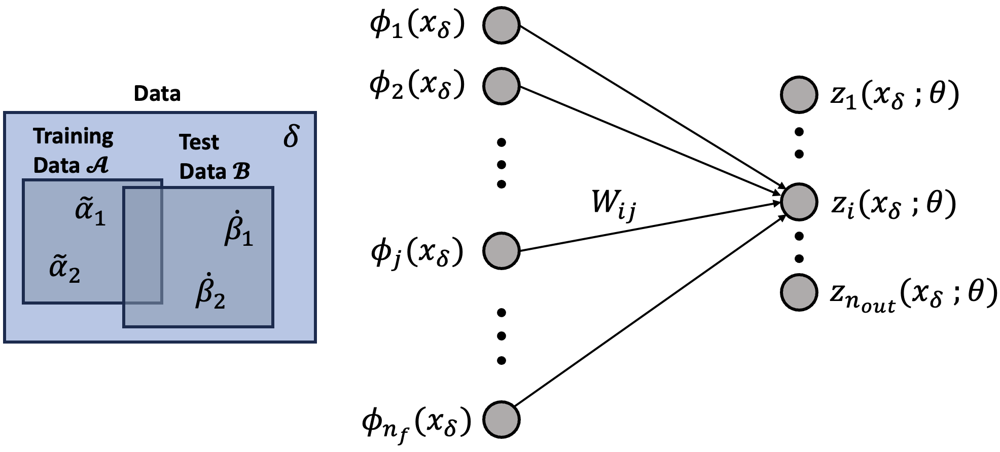

# Deep Learning Theory : Quadratic models and nearly-kernel methods

**Author:** Hyunin Lee  
**Date:** 12.24.2023

## Day2
Lecture 2 is covers Chapter 11.4, chapter7.2 and chapter ∞.2.2 if this book[https://deeplearningtheory.com/lectures/]

## 0.Notations of Deep Neural Network 

## 1. Linear Models and Kernel Methods

Two forms of a solution for a linear model:

- parameter space - linear regression

$$
z_i(x_{\dot{\beta}}; \theta^*) = \sum_{j=0}^{n_f} W_{ij}^* \phi_j(x_{\dot{\beta}})
$$

- sample space - kernel methods

$$
z_i(x_{\dot{\beta}}; \theta^*) = \sum_{\tilde{\alpha}_1, \tilde{\alpha}_2 \in A} k_{\dot{\beta} \tilde{\alpha}_1} \tilde{k}^{\tilde{\alpha}_1 \tilde{\alpha}_2} y_{i;\tilde{\alpha}_2}
$$

## 2. Nonlinear models

Let's relax the above linear model into a nonlinear model, specifically a \textcolor{blue}{quadratic model}.

$$
z_{i;\delta}(\theta) = \sum_{j=0}^{n_f} W_{ij} \phi_j(x_\delta) + \textcolor{blue}{\frac{\epsilon}{2} \sum_{j_1, j_2 = 0}^{n_f} W_{i j_1} W_{i j_2} \psi_{j_1 j_2}(x_\delta)}
$$

- It's nonlinear because it's quadratic in the weights: \( W_{ij_1} W_{ij_2} \).
- \( \varepsilon \) is a small parameter that controls the size of the deformation.
- We've introduced \( \frac{(n_f + 1)(n_f + 2)}{2} \) meta feature functions, \( \psi_{j_1 j_2} (x) \), with two feature indices.

## 3. Quadratic models

To familiarize ourselves with this model, let's make a small change in the model parameters $ W_{ij} \to W_{ij} + dW_{ij} $:

$$
z_i(x_\delta; \theta + d\theta) = z_i(x_\delta; \theta) + \sum_{j=0}^{n_f} dW_{ij} \left( \phi_j(x_\delta) + \epsilon \sum_{j_1=0}^{n_f} W_{ij_1} \psi_{j_1 j}(x_\delta) \right) + \frac{\epsilon}{2} \sum_{j_1, j_2=0}^{n_f} dW_{ij_1} dW_{ij_2} \psi_{j_1 j_2}(x_\delta)
$$

Let us make a shorthand for the quantity in the square bracket,

$$
\textcolor{blue}{\phi^E_{ij}(x_\delta; \theta)} = \frac{dz_i(x_\delta; \theta)}{dW_{ij}} = \phi_j(x_\delta) + \varepsilon \sum_{k=0}^{n_f} W_{ik} \psi_{kj}(x_\delta),
$$

which is a blue{effective feature function}.

## 4. Effective Feature Functions

The utility of this is as follows:

- The *linear response* of \( z_i(x_\delta; \theta) \) behaves *effectively* as if it has a parameter-dependent feature function, \( \phi^E_{ij}(x_\delta; \theta) \).
- The change in the \( \phi^E_{ij}(x_\delta; \theta) \) given \( W_{ik} \to W_{ik} + dW_{ik} \) is

$$
\phi^E_{ij}(x_\delta; \theta + d\theta) = \phi^E
$$

## 5. Quadratic Regression

Supervised learning a quadratic model doesn't have a particular name, but if it did, we'd all probably agree that its name should be quadratic regression:

$$
L_A(\theta) = \frac{1}{2} \sum_{\tilde{\alpha} \in A} \sum_{i=1}^{n_{out}} \left[ y_{i;\tilde{\alpha}} - \sum_{j=0}^{n_f} W_{ij} \phi_j(x_{\tilde{\alpha}}) - \frac{\epsilon}{2} \sum_{j_1, j_2 = 0}^{n_f} W_{ij_1} W_{ij_2} \psi_{j_1 j_2}(\tilde{x}_{\alpha}) \right]^2.
$$

The loss is now quartic in the parameters, but we can optimize with gradient descent:

$$
W_{ij}(t + 1) = W_{ij}(t) - \eta \frac{\partial L_A}{\partial W_{ij}} |_{W_{ij}=W_{ij}(t)}.
$$

This will find a minimum in practice.

## 6. The Theoretical Minimum (linear model)
Let's start by seeing how gradient descent solves the *linear model*:

$$
L_A(W) = \frac{1}{2} \sum_{\tilde{\alpha} \in A} \sum_{i=1}^{n_{out}} \left[y_{i;\tilde{\alpha}} - \sum_{j=0}^{n_f} W_{ij} \phi_j(x_{\tilde{\alpha}}) \right]^2,
$$

Then, we have

$$
\begin{align*}
\frac{\partial L_A(W)}{\partial W_{ab}} &= - \sum_{\tilde{\alpha}, i, j} \delta_{ia}\delta_{jb} \phi_j(x_{\tilde{\alpha}}) \left[ y_{i;\tilde{\alpha}} - \sum_{j=0}^{n_f} W_{ij} \phi_j(x_{\tilde{\alpha}}) \right] \\
&= \sum_{\tilde{\alpha}} \phi_b(\tilde{x}_{\alpha}) (z_{a;\tilde{\alpha}} - y_{a;\tilde{\alpha}}) \\
&= \sum_{\tilde{\alpha}} \phi_b(\tilde{x}_{\alpha}) \epsilon_{a;\tilde{\alpha}}
\end{align*}
$$

In the last line, we defined the *residual training error*:

$$
\textcolor{blue}{\epsilon_{i;\tilde{\alpha}}} = z_{i;\tilde{\alpha}} - y_{i;\tilde{\alpha}}.
$$

The weights will update as

$$
\begin{aligned}
    W_{ij}(t + 1) &= W_{ij}(t) - \eta \frac{d L }{dW_{ij}} \Big|_{W_{ij}=W_{ij}(t)} \\
    &= W_{ij}(t) - \eta \sum_{\tilde{\alpha}} \phi_j(x_{\tilde{\alpha}}) \epsilon_{i;\tilde{\alpha}}(t)
\end{aligned}
$$

For the theoretical analysis, it’s more convenient to understand how the output of the model updates:

$$
\begin{aligned}
    z_{i;\delta}(t + 1) &= z_{i;\delta}(t) + \sum_{a,b} \frac{\partial z_{i;\delta}(t)}{\partial W_{ab}} \left[ W_{ab}(t + 1) - W_{ab}(t) \right] \\ 
    &= z_{i;\delta}(t) + \sum_{a,b} \frac{\partial z_{i;\delta}(t)}{\partial W_{ab}} \left[  - \eta \sum_{\tilde{\alpha}} \phi_b(x_{\tilde{\alpha}}) \epsilon_{a;\tilde{\alpha}}(t)  \right] \\ 
    &= z_{i;\delta}(t) + \sum_{a,b} \delta_{i a}\phi_b (x_\delta) \left[  - \eta \sum_{\tilde{\alpha}} \phi_b(x_{\tilde{\alpha}}) \epsilon_{a;\tilde{\alpha}}(t)  \right] \\
    &= z_{i;\delta}(t)  - \eta \sum_{\tilde{\alpha}} \left[  \sum_{b} \phi_b (x_\delta)  \phi_b(x_{\tilde{\alpha}})  \right]\epsilon_{i;\tilde{\alpha}}(t) \\
    &= z_{i;\delta}(t)  - \eta \sum_{\tilde{\alpha}}  k_{\delta \tilde{\alpha}} \epsilon_{i;\tilde{\alpha}}(t) 
\end{aligned}
$$

- Fixed $k_{\delta \tilde{\alpha}}$ generates the dynamics of the model.
- $\epsilon_{i;\tilde{\alpha}}(t)$ sources the updates for general inputs $\delta \in \mathcal{D}$.

We have to solve a linear difference equation:

$$
z_{i;\delta}(t + 1) = z_{i;\delta}(t) - \eta \sum_{\tilde{\alpha}} k_{\delta \tilde{\alpha}} \epsilon_{i;\tilde{\alpha}}(t).
$$

Restricting to the training set, we get a first-order homogeneous linear difference equation,

$$
z_{i;\tilde{\alpha}_1}(t + 1) = z_{i;\tilde{\alpha}_1}(t) - \eta \sum_{\tilde{\alpha}_2} \kappa_{\tilde{\alpha}_1\tilde{\alpha}_2} \epsilon_{i;\tilde{\alpha}_2}(t),
$$

for the residual training error:

$$
\epsilon_{i;\tilde{\alpha}_1}(t + 1) = \epsilon_{i;\tilde{\alpha}_1}(t) - \eta \sum_{\tilde{\alpha}_2} \kappa_{\tilde{\alpha}_1\tilde{\alpha}_2} \epsilon_{i;\tilde{\alpha}_2}(t),
$$

We can rewrite these dynamics:

$$
\epsilon_{i;\tilde{\alpha}_1} (t + 1) = \sum_{\tilde{\alpha}_2} (\delta_{\tilde{\alpha}_1\tilde{\alpha}_2} - \eta k_{\tilde{\alpha}_1\tilde{\alpha}_2}) \epsilon_{i;\tilde{\alpha}_2} (t)
$$

This is a repeated multiplication by a constant matrix:

$$
U_{\tilde{\alpha}_1\tilde{\alpha}_0} (t) = [(\delta - \eta k)^t]_{\tilde{\alpha}_1\tilde{\alpha}_0} = \sum_{\tilde{\alpha}_1,...,\tilde{\alpha}_{t-1}} (\delta_{\tilde{\alpha}_t\tilde{\alpha}_{t-1}} - \eta k_{\tilde{\alpha}_t\tilde{\alpha}_{t-1}}) \cdots (\delta_{\tilde{\alpha}_1\tilde{\alpha}_0} - \eta k_{\tilde{\alpha}_1\tilde{\alpha}_0}).
$$

The solution is given by

$$
\epsilon_{i;\tilde{\alpha}_1} (t) = \sum_{\tilde{\alpha}_2} U_{\tilde{\alpha}_1\tilde{\alpha}_2} (t) \epsilon_{i;\tilde{\alpha}_2} (0),
$$

and \( U(t) \to 0 \) as \( t \to \infty \) so that the error vanishes: \( z_{i;\tilde{\alpha}} \to y_{i;\tilde{\alpha}} \).

We still have to solve the difference equation for the test error:

$$
Z_{i;\delta}(t + 1) = Z_{i;\delta}(t) - \eta \sum_{\tilde{\alpha}} k_{\delta \tilde{\alpha}} \epsilon_{i;\tilde{\alpha}}(t)
$$

but we are interested in what happens at the end (time \( t \)).

$$
Z_{i;\delta}(t) = Z_{i;\delta}(0) - \sum_{\tilde{\alpha} \in A} k_{\delta \tilde{\alpha}} \left( \eta \sum_{s=0}^{t-1} \epsilon_{i;\tilde{\alpha}}(s) \right)
$$

Now, let's investigate what happens if \( t \to \infty \).

$$
\begin{aligned}
Z_{i;\delta}(\infty) &= Z_{i;\delta}(0) - \sum_{\tilde{\alpha} \in A} k_{\delta \tilde{\alpha}} \left\{ \sum_{s=0}^{\infty} \eta \epsilon_{i;\tilde{\alpha}}(s) \right\} \\
&= Z_{i;\delta}(0) - \sum_{\tilde{\alpha} \in A} k_{\delta \tilde{\alpha}} \left\{ \sum_{s=0}^{\infty} \eta \sum_{\tilde{\alpha}_1} U_{\tilde{\alpha} \tilde{\alpha}_1} (s) \epsilon_{i;\tilde{\alpha}_1}(0) \right\} \\
&= Z_{i;\delta}(0) - \sum_{\tilde{\alpha}, \tilde{\alpha}_1 \in A} k_{\delta \tilde{\alpha}} \left\{ \eta \sum_{s=0}^{\infty} \left[ (\delta - \eta k)^s \right]_{\tilde{\alpha} \tilde{\alpha}_1} \right\} \epsilon_{i;\tilde{\alpha}_1}(0) \\
&= Z_{i;\delta}(0) - \sum_{\tilde{\alpha}, \tilde{\alpha}_1 \in A} k_{\delta \tilde{\alpha}} \left\{ \eta \left[ \delta - (\delta - \eta k) \right]^{-1} \right\}_{\tilde{\alpha} \tilde{\alpha}_1} \epsilon_{i;\tilde{\alpha}_1}(0) \\
&= Z_{i;\delta}(0) - \sum_{\tilde{\alpha}, \tilde{\alpha}_1 \in A} k_{\delta \tilde{\alpha}} \tilde{k}_{\tilde{\alpha}_1} \epsilon_{i;\tilde{\alpha}_1}(0)
\end{aligned}
$$

Compare **gradient descent** vs. the **direct optimization solution**:

$$
\begin{aligned}
z_{i;\delta}(\infty) &= Z_{i;\delta}(0) - \sum_{\tilde{\alpha}, \tilde{\alpha}_1 \in \mathcal{A}} k_{\delta \tilde{\alpha}} \tilde{k}^{\tilde{\alpha} \tilde{\alpha}_1} \epsilon_{i;\tilde{\alpha}_1}(0) \\
z_{i}(x_{\delta}; \theta^*) &= \sum_{\tilde{\alpha}, \tilde{\alpha}_1 \in A} k_{\delta \tilde{\alpha}_1} \tilde{k}^{\tilde{\alpha} \tilde{\alpha}_1} y_{i;\tilde{\alpha}_1}.
\end{aligned}
$$

- Those are same if \( Z_{i;\delta}(0) = 0 \), e.g. if \( W_{ij}(0) = 0 \).
- Otherwise, linear models have **algorithm independence** (different \( \eta \) yields different predictions).
- Importantly, \( k_{\delta \tilde{\alpha}_1} \) is fixed, and the \( \phi_i(x) \) **do not evolve**.

## 7. Quadratic Model Dynamics

The weights will update as

$$
\begin{aligned}
W_{ij}(t + 1) &= W_{ij}(t) - \eta \left. \frac{\partial \mathcal{L}_A}{\partial W_{ij}} \right|_{W_{ij}=W_{ij}(t)} \\
&= W_{ij}(t) - \eta \sum_{\tilde{\alpha}} \phi^{E}_{ij;\tilde{\alpha}} (t) \epsilon_{i;\tilde{\alpha}}(t).
\end{aligned}
$$

While the model and effective features update as

$$
\begin{aligned}
Z_{i;\delta}(t + 1) &= Z_{i;\delta}(t) + \sum_{j} dW_{ij}(t) \phi^{E}_{ij;\delta}(t) + \frac{\epsilon}{2} \sum_{j_1,j_2} dW_{ij_1}(t) dW_{ij_2}(t) \psi_{j_1j_2}(x_{\delta}), \\
\phi^{E}_{ij;\delta}(t + 1) &= \phi^{E}_{ij;\delta}(t) + \epsilon \sum_{k=0}^{n_f} dW_{ik}(t) \psi_{kj}(x_{\delta}).
\end{aligned}
$$

