

  <table>
    <tr>
      <td align="center">
        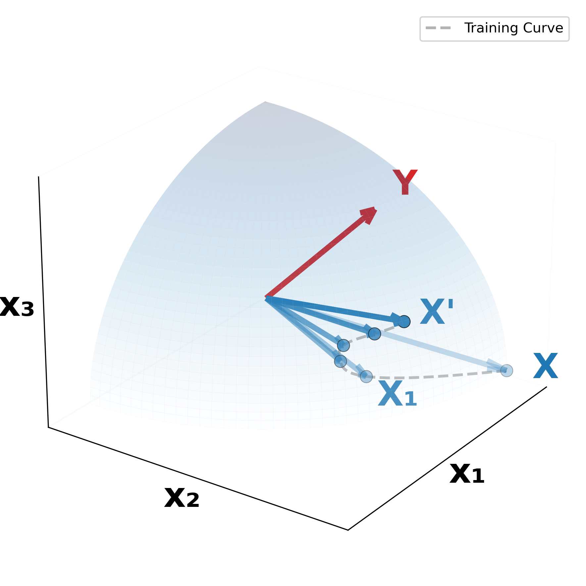
         
        <em>(a) Residual Alignment </em>
      </td>
      <td align="center">
        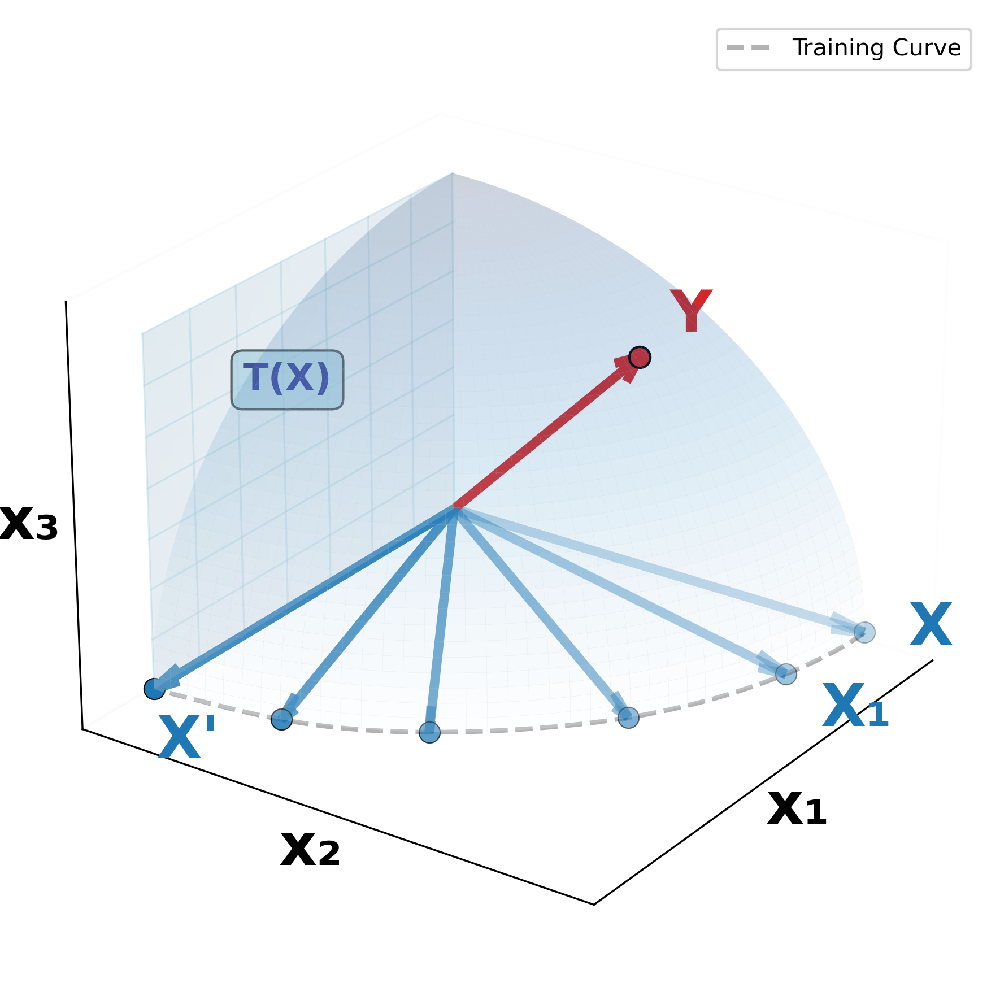
         
        <em>(b) Orthogonal Alignment </em>
      </td>
          <td align="center">
        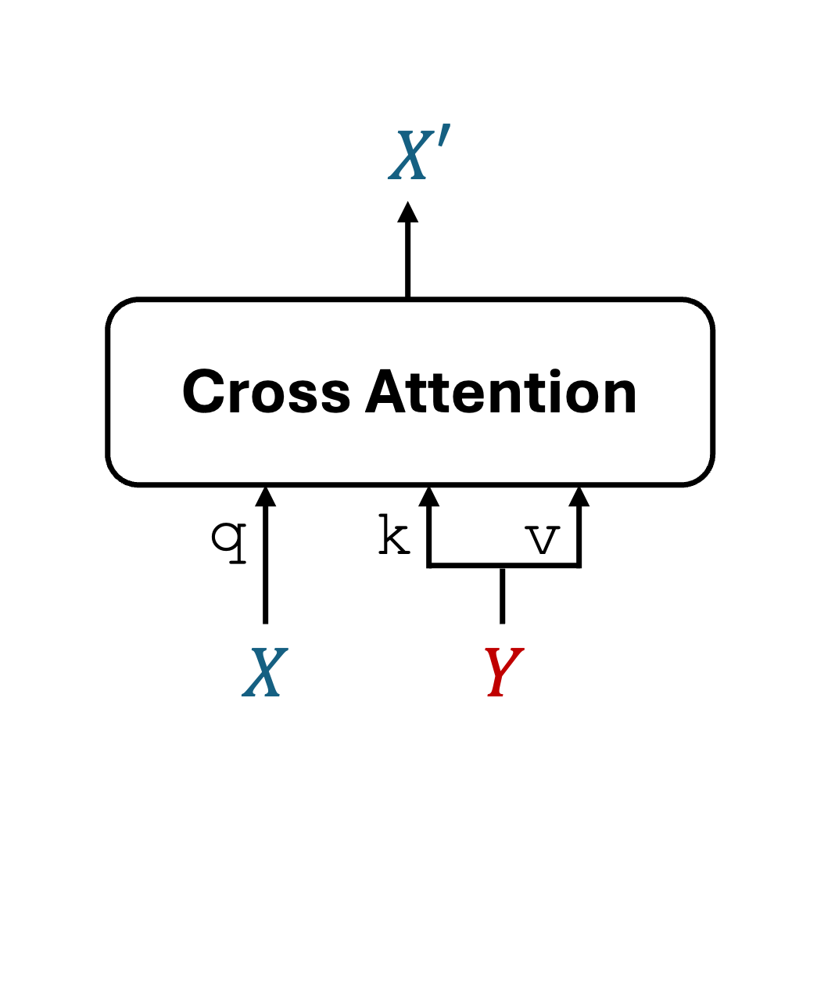
         
        <em>(c) Cross-attention</em>
      </td>
    </tr>
  </table>
  <em>Figure 1: <strong>Conceptual illustration of Orthogonal Alignment.</strong> 
    Given a source representation vector <strong>Y</strong> from domain B, suppose the algorithm progressively updates target representation vector <strong>X</strong> from domain A throughout training iterations {X₁, X₂, ⋯, X′}. 
    <strong>(a) Residual alignment:</strong> The prevailing view of cross-attention is that it refines <strong>X</strong> by reducing irrelevant and preserving relevant information by referring <strong>Y</strong> to update <strong>X′</strong>. 
    <strong>(b) Orthogonal Alignment:</strong> We observe a complement-discovery phenomenon where <strong>X′</strong> becomes increasingly orthogonal to <strong>X</strong> as model performance improves. We show that this orthogonality emerges because cross-attention enables parameter-efficient scaling by extracting complementary information from an orthogonal manifold <strong>T(X)</strong>, thus enhancing performance without a proportional increase in parameters. 
    (c) <strong>X′</strong> is the output of cross-attention, with <strong>X</strong> as the query and <strong>Y</strong> as the key and value.</em>

## Preface.
I’m excited to share a somewhat counterintuitive phenomenon- **Orthogonal Alignment**—with the open-world research community (see Figure 1(b)). Before diving in, a brief disclaimer: this phenomenon has so far been observed only in multi-domain recommendation data, so I remain cautious about generalizing it to vision-language models (or more broadly, to multi-modal learning).

That said, I’m optimistic that Orthogonal Alignment may also appear in vision-language settings, given that our study is grounded in transformer architectures with gated cross-attention—a core component of many modern fusion models. Still, as a researcher, I want to avoid overgeneralization and therefore frame this observation strictly within the recommendation domain until further studies confirm its presence in vision-language models.

Ultimately, my hope is that this discovery inspires new ways of thinking about algorithmic design and sheds light on how to achieve better scaling law in multi-modal models.
In this post, **I want to highlight one simple message**:

<!-- 

**Hypothesis**: Orthogonal Alignment provides more parameter-efficient scaling law in multi-modal model.

 -->

<strong><em>When a multi-modal model exhibits the Orthogonal Alignment phenomenon, it tends to improve scaling law.</em></strong>

I’ve attempted to clarify why this phenomenon *naturally occurs* and identified one possible explanation during my internship at Meta: parameter-efficient scaling. However, the underlying mechanism behind *why on earth this phenomenon naturally emerges* still remains largely a black box, presenting opportunities for deeper investigation. I would be to discuss or further explore why this phenomenon arises — please feel free to reach out.

---

## The Rise of Multi-Modal Recommendation Systems

Imagine you have a dataset D₁=(X₁,Z) and want to build a model that predicts a binary label Z from input X₁. In many real-world cases, the label Z is *extremely* sparse — meaning that most of the values are just zeros.

When I worked on the Ranking AI Research team at Meta, one of my main tasks was building recommendation models that display sponsored posts (ads) on Instagram and Facebook (If user clicks an ad, that’s how Meta earns money💰). The key challenge was data sparsity—users **rarely** clicked on ads, often engaging with only one out of ten sponsored posts, or sometimes none at all. In practice, even though the model continuously recommended posts over every minites -- say, X₁(14:00), X₁(14:01), X₁(14:02), X₁(14:03)..., -- most of these interactions resulted in no clicks, leaving almost all corresponding outcomes as Z = 0.

Since high-quality recommendations rely on accurately modeling user engagement, this extreme sparsity made it difficult to infer user intent. In other words, simply training on D₁ was not enough to build a truly effective recommendation system.

One effective way to address this problem is to incorporate richer signals from other domains D₂=(X₂,Z) — for example, how long a user stays on which type of post or whether they leave a comment or have shared with others. These additional behavioral cues provide valuable context about user interests and help reduce the impact of sparse labels of other domain D₁.

This observation motivates a central research problem in multi-modal learning -- *developing architectural principles that enable the effective fusion of heterogeneous behavioral modalities*.

A widely adopted solution is the **cross-attention** mechanism, which learns to align and project information from different domains into a shared latent space. This allows the model to combine diverse signals and better capture a user’s overall intent — even when direct click data is scarce.

<!-- 
In recent years, the rapid growth in artificial intelligence (AI) has led to an explosion not only in data volume but also in data diversity. For example, users now leave interaction traces across:

- Multiple platforms: Facebook, Instagram, Amazon
- Different scenarios within a single platform: buying products, leaving comments, clicking ads
- Various categories within a single scenario: books, movies, groceries

Furthermore, the advent of the transformer architecture has significantly advanced recommendation systems, enabling the extraction of user intent from behavioral sequences.

As a result, Cross-Domain Sequential Recommendation (CDSR) systems (or multi-domain recommendation system) have emerged, aiming to combine heterogeneous behavioral sequences from diverse sources to improve overall recommendation performance. The hope is that signals collected from various sequential data sources can complement each other.

However, naive approaches to combining signals often suffer from performance degradation due to:
- **Noisy** inter-domain information
- **Redundant** cross-domain signals
- **Conflicting** domain interactions

This has led to one of the main challenges in CDSR: designing a fusion architecture that can effectively handle these heterogeneous sequences.

The most widely adopted solution is the **cross-attention mechanism**, which aligns and projects representations from different domains into a unified latent space.
-->

---

## What Cross-Attention do?: Residual Alignment View

Despite its popularity, the internal mechanisms of cross-attention across domains remain poorly understood and are largely explored through empirical studies.

So far, current research views cross-attention as enabling one domain (<strong>X</strong> in Figure 1c) to query another (<strong>Y</strong> in Figure 1c) and integrate only the most relevant information (<strong>X'</strong> as a weighted sum of <strong>Y</strong> in Figure 1c).

A growing body of empirical evidence supports this view, especially in various multi-modal models:

- In text-to-image diffusion, cross-attention maps reveal faithful token-to-region correspondences, acting as denoising and relevance filters rather than as indiscriminate fusion.

- In representation disentanglement, cross-attention functions as an inductive bias, promoting the separation of complementary factors and encouraging aligned, non-redundant representations.

- In vision-language model, studies aligning attention maps with human gaze patterns show that effective cross-attention concentrates on causally relevant regions, confirming its selective filtering behavior.

Therefore, understanding cross-attention as a **"residual alignment"** mechanism is the prevalent interpretation within the research community.

<!-- > The field views cross-attention as primarily a **residual alignment** mechanism, where the output (<strong>X'</strong>) is a filtered version of the input (<strong>X</strong>) that retains only the most relevant information from the query (**Y**). -->

Current research interprets cross-attention as primarily a <strong>residual alignment</strong> mechanism, where the output (<strong>X′</strong>) is generated by removing redundant information and preserveing relevant content from the input (<strong>X</strong>) by referencing another domain (<strong>Y</strong>).

---

## Orthogonal Alignment

This work challenges this conventional view and uncovers a new, counter-intuitive mechanism of cross-attention.

  

    A Co-Existence Observation in Multi-Modal Learning
  

  

    <strong><em>We argue that two contrasting alignment mechanisms are able to co-exist in cross attention:
      
    1. Residual Alignment (conventional view) 
    2. Orthogonal Alignment (our discovery)</em></strong>
  

We define an Orthogonal Alignment Phenomenon as follows.

<strong>
<em>An Orthogonal Alignment is a phenomenon where the input query (<strong>X</strong>) and the output (<strong>X'</strong>) of the cross-attention are orthogonal, rather than simply reinforcing the existing pre-aligned features of <strong>X</strong> when updating to <strong>X'</strong>
</em></strong>

<!-- > **Orthogonal Alignment**: A representational alignment mechanism where the input query (<strong>X</strong>) and the output (<strong>X'</strong>) of the cross-attention are **orthogonal**, rather than simply reinforcing the existing pre-aligned features of <strong>X</strong> when updating to <strong>X'</strong>. -->

Please refer to Figure 1 for a visual illustration of this phenomenon, contrasted with the conventional residual-alignment perspective.

#### What is role of <strong>Y</strong> in Orthogonal Alignment?

After reading the above definition of Orthogonal Alignment, a natural question arises: “Then, what is the role of <strong>Y</strong>?” 

My interpretation is that the query <strong>Y</strong> functions as a guide that identifies which directions on the tangent space of <strong>X</strong> correspond to positive transfer signals. More concretely, consider the tangent space of <strong>X</strong>. Within this space, there exist multiple orthogonal directions—some leading to negative transfer, others contributing to positive transfer. In principle, all of these directions could serve as candidates for <strong>X′</strong>, since they are orthogonal to the original <strong>X</strong>. Then, the introduction of <strong>Y</strong> provides the crucial signal that distinguishes among these directions—indicating which orthogonal components are constructive (positive transfer) and should therefore be incorporated into <strong>X′</strong>.

Intuitively, <strong>Y</strong> acts as a directional filter that orients the orthogonal updates toward beneficial regions of the feature manifold, enabling cross-attention to expand representational capacity without amplifying redundant correlations.

#### Experiment results.

Empirically, we observe that the Gated Cross-Attention (GCA) module enhances recommendation performance by generating outputs that are not merely filtered versions of the input query(See Figure 2). In simple terms, GCA introduces a learnable gating mechanism that combines the input and the cross-attention output as <strong>X</strong> + α<strong>X'</strong>  where <strong>X'</strong> is the output of cross attention and α is a learnable parameter. This formulation allows the model to produce complementary representations—capturing aspects of the input query that were previously underrepresented or unseen.

We evaluated this effect using three recent Cross-Domain Sequential Recommendation (CDSR) models: LLM4CDSR¹, CDSRNP², and ABXI³ -- all of which are transformer-based architectures reported as state-of-the-art in their respective papers. In Figure 2, the evaluation metric NDCG@10 (Normalized Discounted Cumulative Gain at rank 10) measures how accurately each model ranks the top 10 items compared with the ground-truth order—that is, how well it predicts both which items should appear and in what order. The x-axis represents the absolute value of the cosine similarity between <strong>X</strong> and <strong>X′</strong> for both Domain A and Domain B, where the blue dots correspond to Domain A and the red dots correspond to Domain B.

To ensure robustness, we conducted experiments with multiple random initializations, several GCA architectural variants, and different datasets. Each configuration corresponds to one datapoint in the three subfigures below, and each point represents the best test results from its train process.

Overall, the results consistently demonstrate that the Orthogonal Alignment effect—induced by GCA—leads to model performance increases: **Lower cosine similarity indicates stronger orthogonal alignment, which tends to correlate with higher NDCG@10**.

  <table>
    <tr>
      <td align="center">
        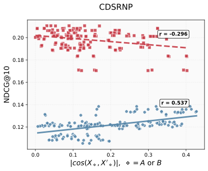
         
        <em>(a)CDSRNP </em>
      </td>
      <td align="center">
        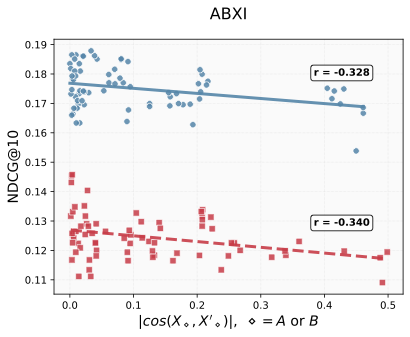
         
        <em>(b) ABXI </em>
      </td>
          <td align="center">
        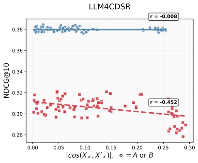
         
        <em>(b) LLM4CDSR</em>
      </td>
    </tr>
  </table>
  <em>Figure2. We observed that the gated cross-attention module introduces an unseen, orthogonal feature representation: as the input query <strong>X</strong> and its cross-attended output <strong>X'</strong> (conditioned on key and value <strong>Y</strong>) become more orthogonal, the ranking performance improves. Blue color dots are domain A and red color dots are domain B</em>

---

## Orthogonal Alignment improves scaling law

Crucially, we classify orthogonal alignment as a **phenomenon** because we empirically show that it **emerges naturally**, without requiring **ANY** explicit orthogonality regularization in either:  Loss formulation or Model architecture. So why this pheomena just naturally happens? This is where this works' main contribution comes from.

We argue that this phenomenon improves scaling law in multi-modal model:

<strong><em>Hypothesis: Orthogonal Alignment improves scaling law in multi-modal model.</em></strong>

By ensuring that updates occupy subspace orthogonal to the input query, the model gains new representational capacity without needing more parameters.

We compare two approaches:
1. Baseline + GCA module
2. Parameter-augmented baseline (simply increasing parameters)

For instance, suppose the baseline model has 2 M parameters and the GCA module adds 0.5 M. To make the comparison fair, we also evaluate a parameter-augmented baseline with 2.5 M parameters—matching the total parameter count of the GCA-enhanced model. 

**We observed that the Baseline + GCA consistently outperformed the parameter-augmented baseline, demonstrating that the performance gain comes from orthogonal alignment rather than mere model scaling** (see Figure 3).

In Figure 3, Baseline + GCAearly refers to inserting a single GCA module at the early stage of the model, while Baseline + GCAstack denotes stacking multiple GCA modules vertically throughout the network—from early to later layers.

  <table>
    <!-- First row: 3 figures -->
    <tr>
      <td align="center">
        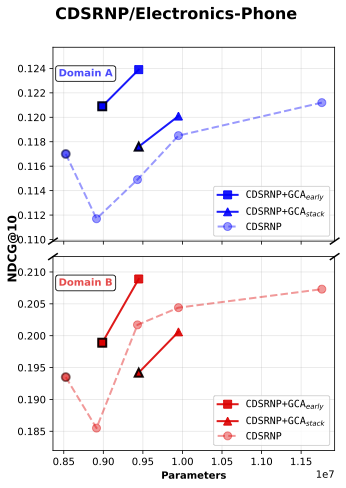
         
        <em>(a) CDSRNP </em>
      </td>
      <td align="center">
        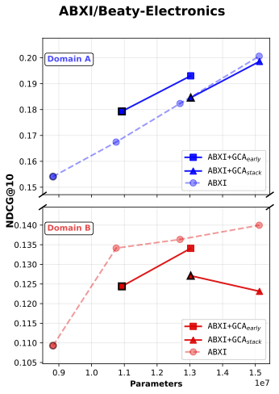
         
        <em>(b) ABXI </em>
      </td>
      <td align="center">
        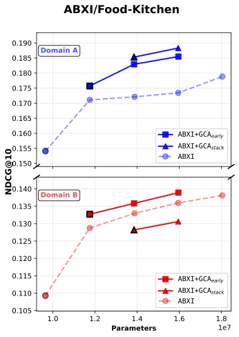
         
        <em>(c) ABXI </em>
      </td>
    </tr>
    <!-- Second row: 2 figures -->
    <tr>
      <td align="center">
        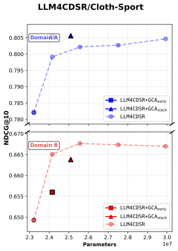
         
        <em>(d) LLM4CDSR </em>
      </td>
      <td align="center">
        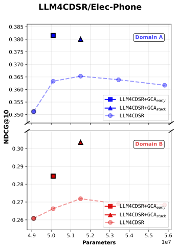
         
        <em>(e) LLM4CDSR </em>
      </td>
      <td align="center">
        <!-- Empty cell to maintain table structure -->
      </td>
    </tr>
  </table>
  
  <em>Figure 3: NDCG@10 comparison between baseline and baseline + gated cross attention model</em>

First, our results show that across all five experimental cases, the addition of baseline with GCA_early consistently yields higher single-domain ranking performance (Domain A’s NDCG@10) compared to parameter-matched baselines, while Domain B’s NDCG@10 also shows general improvement.

Moreover, in both LLM4CDSR settings, GCAearly demonstrates the strongest parameter efficiency. We attribute this advantage to the fixed hidden dimensionality of the initial embedding vectors inherited from the pretrained LLM, which constrains the representational capacity of the baseline model. As a result, simply scaling up the baseline parameters eventually leads to performance saturation—and in some cases, degradation—as model size increases.

In contrast, introducing orthogonal alignment through GCA enables more effective information extraction under limited representational capacity. This property allows GCA to achieve a superior accuracy-per-parameter trade-off, demonstrating a more efficient use of model capacity.

## Concluding Remark: Toward Vision–Language Generalization

We remain cautious about generalizing our findings to vision–language models, since all of our experiments on Orthogonal Alignment were conducted exclusively with recommendation data. Nonetheless, we are optimistic that similar phenomena could emerge in vision–language settings, given that our study also relies on transformer architectures with gated cross-attention—a core component in many multi-modal models.

The key distinctions between our setting and typical vision–language architectures are as follows:

  - Our observations of orthogonal alignment were made using recommendation data, where encoder representations were not pre-aligned.

  - Vision–language models, in contrast, generally employ pretrained image and text encoders that produce highly aligned representations by design.

This difference matters because most vision–language encoders are trained using self-contrastive objectives, which explicitly encourage high cosine similarity between matching image–text pairs and low similarity between mismatched ones. As a result, their latent representations are already well-aligned before cross-attention is applied—potentially making orthogonal alignment less pronounced or more difficult to observe directly.

Therefore, while we expect Orthogonal Alignment to exist in vision–language models, it may manifest under more subtle and nuanced conditions, reflecting the already pre-aligned nature of their learned embeddings.

---

**References:**

¹ LLM4CDSR: Liu, Qidong, et al. "Bridge the Domains: Large Language Models Enhanced Cross-domain Sequential Recommendation." Proceedings of the 48th International ACM SIGIR Conference on Research and Development in Information Retrieval. 2025. 

² CDSRNP: Li, Haipeng, et al. "Cross-Domain Sequential Recommendation via Neural Process." arXiv preprint arXiv:2410.13588 (2024).

³ ABXI: Bian, Qingtian, et al. "ABXI: invariant interest adaptation for task-guided cross-domain sequential recommendation." Proceedings of the ACM on Web Conference. 2025.