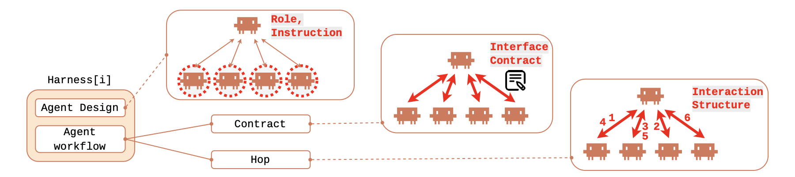
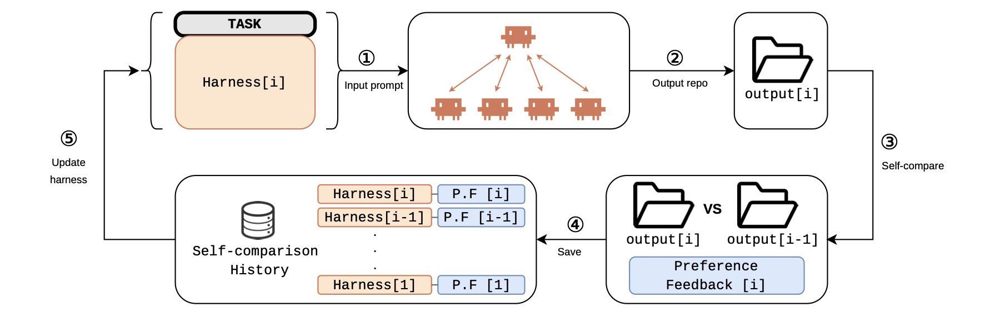
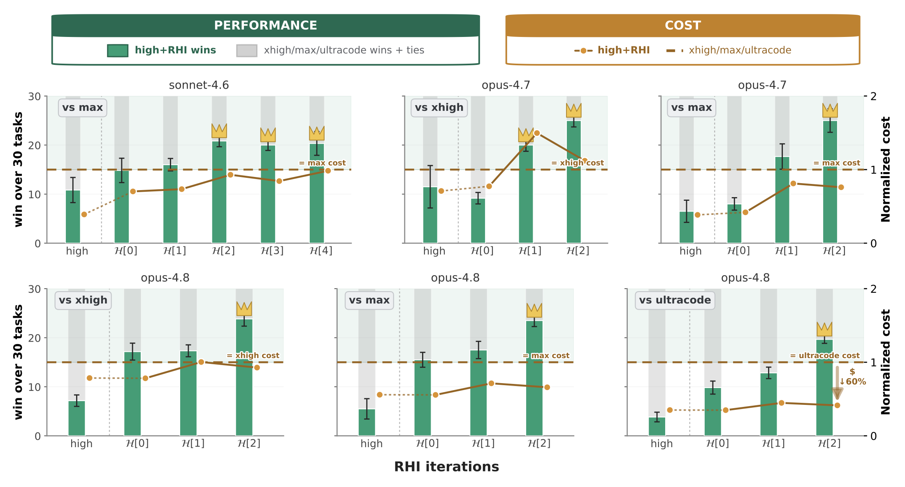
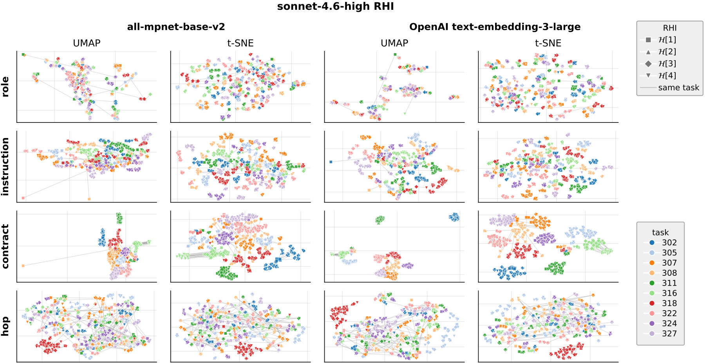

  <video
    src="../assets/RHI_combined_full_revised.mp4"
    poster="../assets/RHI_combined_full_poster.png"
    autoplay loop muted playsinline controls
    width="860"
    style="max-width: 100%; border-radius: 14px; box-shadow: 0 6px 24px rgba(0,0,0,0.12);">
    Your browser does not support embedded video.
    <a href="../assets/RHI_combined_full_revised.mp4">Open the video directly.</a>
  </video>
   
  <em>Recursive Harness Self-Improvement (RHI) reorganizes multi-agent systems.</em>

## Will models eat the harness?

A growing view in AI is that harnesses are temporary. As models become more capable, the argument goes, they will internalize the reasoning patterns, tool-use strategies, and coordination rules that we currently build around them. [Noam Brown described the ideal harness as "no harness"](https://www.latent.space/p/noam-brown): external scaffolding is a crutch that increasingly general models should eventually move beyond. [Logan Kilpatrick made a closely related prediction](https://sequoiacap.com/podcast/google-deepminds-logan-kilpatrick-why-the-model-eats-the-harness/): the model "eats" the scaffolding, turning today's external orchestration into part of tomorrow's native model system.

We agree that models will absorb many capabilities now implemented in harnesses. But this does not make the harness irrelevant. It changes its role.

Before a capability can be internalized, a harness is often the system that elicits it, tests it, and records it. Harnesses organize agent workflows that produce solution attempts, critiques, tool calls, intermediate failures, and successful trajectories. These execution traces can then become post-training data for future foundation models.

This creates a recursive model–harness co-evolution loop:

> **Better model → stronger harness → better execution traces → post-training → better model**

A stronger model enables more capable harnesses. Better harnesses, in turn, can produce more useful traces for training the next model. We call this **harness-in-the-loop learning**: optimizing a harness not only for immediate agent performance, but also for the quality of the traces available for future training. The specific scaffolding may move into model weights or provider systems, but harness design remains an active part of the data flywheel: it determines what behavior is elicited and what data is collected for the next round of learning.

The key bottleneck is therefore not only the number of traces, but their quality. A weak harness can generate duplicated work, irrelevant context, missing evidence, or poorly coordinated attempts. A strong harness can produce traces with clearer task signal, better division of labor, and more useful feedback.

Our paper studies the **first half of this loop**. We keep the foundation model fixed and ask how to improve a user-constructed, task-specific harness so that it produces better executions. We do not yet train a future model on those traces; closing that second half of the loop is future work. User-constructed harnesses are a practical optimization surface because they can be specialized without retraining the model or continually redesigning a provider-built system for every task.

To address the first half, we introduce **Recursive Harness Self-Improvement (RHI)**. RHI represents the harness as editable text and adapts it through pairwise feedback from its own previous attempts. The method is designed to be lightweight enough for users to apply to individual tasks and effective within only a few update iterations.

Across 30 synthetic machine-learning research tasks, one or two RHI updates allowed `high`-reasoning agents to outperform the stronger same-family test-time-scaling settings we evaluated. With Claude Opus 4.8, the resulting agent execution also cost up to **60% less** than the `ultracode` baseline.

## The harness as a prompt-level object

Much of the recent work on automatic harness optimization searches in **code space**: [Meta-Harness](https://arxiv.org/abs/2603.28052) evolves executable harness code from earlier candidates and their execution traces; [AutoHarness](https://arxiv.org/abs/2603.03329) synthesizes and refines code harnesses from environment feedback; [Self-Harness](https://arxiv.org/abs/2606.09498) proposes harness edits and accepts them through regression testing. Related workflow-search methods likewise represent agents as programs, graphs, or executable pipelines.

RHI changes the optimization variable. **Instead of treating the harness as an executable program, we treat it as a prompt-level object**: a structured piece of text appended to the task prompt. The optimizer neither rewrites provider code nor searches over executable workflows; it rewrites only the textual specification that tells the coding agent how to organize its work. In RHI, harness optimization is prompt optimization. 

Viewing the harness itself as a prompt confers two advantages. 

First, it works even with black-box models: the agent's behavior can be steered simply by describing the harness in text and placing that description in the prompt. Second, it makes the harness cheap to revise: maintaining a full code-level harness that handles arbitrary queries is labor- and cost-intensive, whereas a task-specific harness expressed as text can be updated with little effort—a lightness that makes the harness a natural building block for model–harness co-evolution.

## Intuition behind our harness definition

Under this prompt-level formulation, we define the harness as the agent loop and decompose it into four components:

- **Roles** define what each agent is responsible for.
- **Instructions** define how each agent should work.
- **Contracts** define what information an agent must return.
- **Hops** define when agents run and how control moves through the workflow.

Roles and instructions specify the agent design; contracts and hops specify the agent workflow. Together, the four components turn multi-agent coordination into text—text that can be inspected, compared, and improved.

  
   
  <em>RHI represents agent design and workflow as an editable textual harness.</em>

Now, why define the harness as the agentic loop, when the literature offers so many competing taxonomies? Recent surveys ([paper1](https://picrew.github.io/LLM-Harness/main.pdf), [paper2](https://arxiv.org/pdf/2606.20683)) catalogue the ingredients a harness definition might build on—context, loops, state, verification, and more.

We chose the loop because it is the piece of the harness whose importance practitioners have discovered empirically. Notice how the field's vocabulary has evolved: from [*harness* engineering](https://martinfowler.com/articles/harness-engineering.html) to [*loop* engineering](https://simonwillison.net/2025/Sep/30/designing-agentic-loops/) to [*graph* engineering](https://x.com/IntuitMachine/status/2078419526354378975). This progression is a trace of accumulated engineering knowledge—within the harness at large, researchers first recognized the loop as the structure that matters, and the search for an optimal loop was then generalized into a graph problem. **Our work engages this trend directly**: we propose an algorithm that improves the agentic loop itself.

Granting the loop, a second question follows: why decompose it into precisely these four components?

The decomposition rests on our hypothesis, one that speaks to performance and cost at once: **tailoring the agent workflow to the task should both improve performance and reduce cost, because agents exchange only the context the task actually needs**.

A welcome corollary of this framing is that it sheds light on how harness optimization itself should be defined. 

**This decomposition makes harness optimization an information-routing problem.** For example, a *generic* contract may ask an experimental agent to "return its findings." A *task-specific* contract instead requires the exact metrics, assumptions, failure cases, and artifact paths that downstream agents need. The task-specific contract routes less irrelevant context and more decision-relevant evidence.

For concrete examples of how RHI updates a harness, see [Appendix B: Examples of RHI Harnesses]().

## Recursive Harness Self-Improvement

With the harness defined, one question remains: how to improve it. The natural approach—maintaining and evolving a large population of candidate harnesses—is expensive: every candidate requires a complete agent execution, and comparing all candidate pairs grows quadratically with the population size. Nor is this cost a side issue, for what ultimately matters is *performance per unit cost*. Indeed, [*Rethinking the Evaluation of Harness Evolution for Agents*](https://arxiv.org/pdf/2607.12227) compares automatic harness evolution with simpler test-time-scaling methods under matched feedback and inference budgets: on Terminal-Bench 2.1, harness evolution did not consistently outperform parallel sampling or sequential refinement, and its improvements transferred poorly to held-out tasks.

The practical lesson is that *a search algorithm must account for its own cost*. Under a fixed budget, every token spent discovering a harness is a token that could have been spent directly on test-time scaling. **A practical harness optimizer must therefore be lightweight in both computation and cost, yet still deliver useful updates within a few iterations.**

RHI is designed around precisely this constraint. It abandons population search in favor of *on-trajectory* search: each update revises the current harness directly, guided only by self-comparison feedback between consecutive attempts along the trajectory.

Concretely, for a task $x$, let $H^{(i)}$ be the harness at iteration $i$ and $y^{(i)}$ the repository produced with it. Each RHI iteration performs four steps:

1. Run the fixed coding agent with $H^{(i)}$ to produce $y^{(i)}$.
2. Ask an LLM evaluator to compare $y^{(i)}$ with $y^{(i-1)}$.
3. Append the preference feedback to the self-comparison history.
4. Ask a separate LLM optimizer to revise $H^{(i)}$ into $H^{(i+1)}$ using the accumulated history.

  
   
  <em>RHI compares consecutive outputs, saves the feedback, and uses the accumulated history to revise the harness.</em>

This "on-trajectory self-comparison" makes the loop computationally lightweight. Because the previous output is cached, each update requires only one harness-optimizer call and one new evaluation call per task. Here, the evaluator produces its feedback using an evaluation rubric, but the harness optimizer never sees that rubric. It must infer useful revisions from the comparison history alone.

As expected, such a lightweight update rule inevitably yields noisy local ascent. A comparison with one predecessor is not a global estimate of harness quality, and improvement is not guaranteed to be monotonic. On the practical side, we keep the preference-feedback history as a momentum signal to make the ascent more robust. On the theoretical side, we show a mild guarantee: under a standard latent-utility model of pairwise preference, beating the previous harness is aligned with moving upward in the same quality ordering.

## Benchmark & evaluation

We constructed 30 synthetic, open-ended ML research tasks: ten each in quantitative finance, robotics, and pharmacy. Each task asks the agent to build a complete research repository, including a report, reproducible code, metrics, visualizations, and an artifact index.

These are the kinds of tasks everyday users bring to research agents; unfortunately, they are almost unverifiable (i.e., very hard to verify accurately) because they have no single correct scalar answer. We therefore approximate the evaluation with multiple verifiable criteria scored by LLM judges: deliverable coverage, empirical rigor, reproducibility, presentation, engineering quality, and task alignment. Results are averaged across multiple evaluator configurations and three random seeds.

We test three progressively stronger base models—Claude Sonnet 4.6, Opus 4.7, and Opus 4.8. In each case, RHI adapts a `high`-reasoning agent and compares it with stronger same-family settings such as `xhigh`, `max`, and `ultracode`.

## Results: a few harness updates beat the evaluated scaling baselines

  
   
  <em>A few RHI iterations improve pairwise wins beyond the evaluated test-time-scaling baselines. The overlaid line shows normalized execution cost.</em>

| Base model | RHI result | Execution-cost comparison |
|:--|:--|:--|
| Sonnet 4.6 | After two updates, `high` + RHI beat `max`, winning 20 of 30 comparisons. | 7% lower than `max` |
| Opus 4.7 | After one update, `high` + RHI surpassed both `xhigh` and `max`. | 18% lower than `max` |
| Opus 4.8 | After two updates, `high` + RHI surpassed `xhigh`, `max`, and `ultracode`. | 23% lower than `max`; 60% lower than `ultracode` |

First, it is clear that few-shot RHI (around two iterations) adapts the `high`-reasoning agent to outperform stronger test-time scaling (`xhigh`, `max`, and `ultracode`) across all base models. **RHI can therefore lift performance beyond the plateau of test-time scaling within a few iterations.** One addition: the Opus 4.8 result is especially notable because `ultracode` already uses a provider-built dynamic multi-agent workflow. We believe this opens a *new hypothesis: a task-specific, user-side harness can be more effective than a general-purpose, built-in system harness.*

Note that these cost numbers describe the final execution with the evolved harness, **not** the total cost of discovering it. This remains a limitation of RHI: it still pays for each intermediate agent run, evaluation, and optimizer call. Adaptation is therefore most attractive when the harness will be reused, when a few iterations fit within the task budget, or when the intermediate executions are themselves useful.

One more observation—we omit the figure here, but see Figures 5b, 6c, and 7e in the paper: it is clear that the **RHI gains do not come primarily from generating more tokens**. For Sonnet 4.6 and Opus 4.8, output-token use stayed nearly *flat* across RHI iterations while performance improved. Moreover, across all three models, the evolved harnesses used *fewer* cache reads and writes than the strongest comparison settings, which supports the view that the **performance gains come largely from more efficient context management**.

## What really drives RHI's performance gains?

Our analysis points to the **contracts**—the information flow between agents—as a key driver.

We text-embedded the components of every harness update and examined them in a low-dimensional space. At the component level, **contracts show the clearest task-dependent clustering** across embedding models (`text-embedding-3-large` and `all-mpnet-base-v2`) and projection methods (`UMAP` and `t-SNE`). In the paper's figures, contracts also converge faster than roles, instructions, and hops.

  
   
  <em>Harness components for the robotics tasks. Colors denote tasks and marker shapes denote RHI iterations. Across two embedding models and both UMAP and t-SNE, contracts show the clearest task-dependent separation.</em>

**Why contracts?**

Our interpretation is that the **contract is one of the few variables that can improve performance and inference cost at the same time**. 

Optimizing the information flow between agents resembles *finding the sparsity pattern in sparse attention*. In general, optimizing a contract makes the flow more selective: it can dramatically reduce context usage—and therefore inference cost—but risks high variance in performance, since the wrong information may be dropped. RHI, however, optimizes contracts to be *task-specific*: from each agent's context and output, the contract cherry-picks only what is relevant to solving the task and passes it to the next agent. Optimizing contracts to be task-specific can therefore gain on both axes, performance and cost.

**Then why do roles, instructions, and hops not cluster as clearly?** 

We see three possible interpretations. 
- First, roles, instructions, and hops may simply not be the best optimization variables for the harness; this opens a future direction of searching for harness components that can change performance more directly. 
- Second, these three components may need more iterations to adapt. 
- Third, the current feedback design of RHI may be informative enough to fully update contracts but not the other three components; this calls for another future direction—devising a better LLM-feedback loop for harness optimization. 

## What is the hidden objective function of black-box harness optimization?

Now we bring up an interesting analysis. The whole harness-optimization loop is a entirely black-box procedure: we cannot observe what is happening inside. 

Here we suggest one elegant candidate for the objective that general harness optimization may be implicitly pursuing. The following information-theoretic objective summarizes the pattern we observe across all harness updates:

<strong>Hypothesis: a general objective for harness optimization</strong>

Let $X$ be a task drawn from a task distribution, $g_i(X)$ its harness after optimization step $i$, and $\mathcal{C}$ the set of harness components. Let $\mathcal{C}_{\mathrm{ext}}\subseteq\mathcal{C}$ contain the components explicitly targeted by human designer, and let $Z_c^{(i)}$ represent component $c$. Effective harness optimization should:

1. **increase task information** in the targeted components; and
2. **decrease task-conditional redundancy** across the harness as a whole.

Suppressing averages over repeated components for readability, the corresponding objective is

$$
\begin{aligned}
J(g_i)
=
&\underbrace{
\sum_{c\in\mathcal{C}_{\mathrm{ext}}}
I\!\left(Z_c^{(i)};X\right)
}_{f_{\mathrm{ext}}:\;\text{task-relevant information}}
-\beta\,
\underbrace{
\mathrm{TC}\!\left(
\left\{Z_c^{(i)}:c\in\mathcal{C}\right\}
\mid X
\right)
}_{f_{\mathrm{int}}:\;\text{redundancy given the task}},
\qquad \beta>0.
\end{aligned}
$$

In one sentence: 

Encode task information in the harness components the human designer wants to improve, while keeping every component as functionally distinct as possible.

The first term favors task information in the components driven by the "Harness-optimizer prompt"—contracts and hops in our implementation. 

The second discourages different harness components from repeating the same information once their shared task is taken into account.

We test whether the RHI algorihtm maximizes objective function using two embedding modules, with both raw and permutation-debiased estimates. To keep the presentation compact, the table show the endpoints from RHI iteration 1 to iteration 4; the table reports every intermediate iteration.

**First term: task information moves into the harness components we target.** Each cell reports estimated $I(\text{component};\text{task})$ in nats, from iteration 1 to iteration 4.

| Component | OpenAI, raw | OpenAI, debiased | MPNet, raw | MPNet, debiased |
|:--|--:|--:|--:|--:|
| Role | 0.63 → 0.42 | 0.47 → 0.33 | 0.44 → 0.28 | 0.28 → 0.19 |
| Instruction | 1.14 → 1.09 | 0.99 → 1.00 | 0.96 → 0.82 | 0.80 → 0.73 |
| Contract ↑ | 1.14 → 1.42 | 0.99 → 1.34 | 0.77 → 0.98 | 0.62 → 0.90 |
| Hop ↑ | 2.10 → 2.66 | 1.96 → 2.54 | 1.89 → 2.17 | 1.74 → 2.05 |

As the RHI iterations proceed, contracts and hops become more informative about the task in all four settings. Roles become less task-specific, while instructions remain roughly stable or decline.

Our interpretation is that RHI emphasizes updating the workflow components (contracts and hops) rather than the agent design (roles and instructions)—we say so explicitly in the harness-optimizer prompt. The RHI algorithm therefore encodes task information into the harness components the human designer cares about. This is a kind of "nudging" process.

**Second term: Redundancy falls across all harness components.** 

This one is more interesting. Each cell reports total correlation in nats, again from iteration 1 to iteration 4.

| Dependence measure | OpenAI, raw | OpenAI, debiased | MPNet, raw | MPNet, debiased |
|:--|--:|--:|--:|--:|
| Overall total correlation | 7.53 → 6.36 | 6.66 → 5.81 | 5.71 → 4.72 | 4.82 → 4.19 |
| Task-conditional total correlation ↓ | 5.18 → 3.92 | 4.84 → 3.63 | 3.89 → 2.86 | 3.51 → 2.62 |

Both dependence measures decrease in every setting as the RHI iterations proceed. Most importantly, task-conditional total correlation falls even after accounting for the shared task signal. Qualitatively, this means that **even though the harness components all know what the task is, they evolve to become mutually independent**.

**To be honest, this is counterintuitive**. The intuitive picture of a "task-specific harness" is that all components share as much task information as possible, so their mutual dependence should *increase* over iterations.

Our interpretation is a bit different. We believe the decrease in task-conditional total correlation shows that the harness components are evolving to be functionally distinct. 

A good metaphor is that each component is evolving to find an appropriate **basis** of the harness space. That is:  

**Harness optimization over discrete components resembles learning a basis for that space**.

## Hypothesis: a rule of thumb for practical harness optimization

Now, here is our hypothesis on a philosophy of harness engineering (one that still needs plenty of verification—please reach out; we would be happy to collaborate on this!):

> **Encode task information in the harness components the human designer wants to improve, while keeping every component as functionally distinct as possible.**

For a deeper discussion of this hypothesis and its implications for harness design, see my blog post [*Toward the science of harness optimization*](https://hyunin-lee.github.io/Toward-the-science-of-harness-optimization/).

## Scope and outlook

The results are promising, but their scope matters. The benchmark contains 30 synthetic ML research tasks, and quality is measured through pairwise LLM judgment. Broader conclusions require real user workloads, other agent environments, and additional model providers. The efficiency analysis also separates the cost of an evolved execution from the total adaptation cost.

RHI provides one concrete step toward the larger model–harness co-evolution loop. The next step is to test whether the resulting execution traces improve future models through post-training—and whether those models, in turn, enable the next generation of harnesses.

---

  <strong>Recursive Harness Self-Improvement</strong> 
  Hyunin Lee1,2, Jinglue Xu1, Jeffrey Seely1, Donghyun Lee2, Matei Zaharia2, and Yujin Tang1 
  <em>1Sakana AI &nbsp;·&nbsp; 2UC Berkeley</em>

**Paper and code:** links will be added when the public release is available.

For questions or potential collaborations, please [reach out](mailto:hyunin@berkeley.edu).
