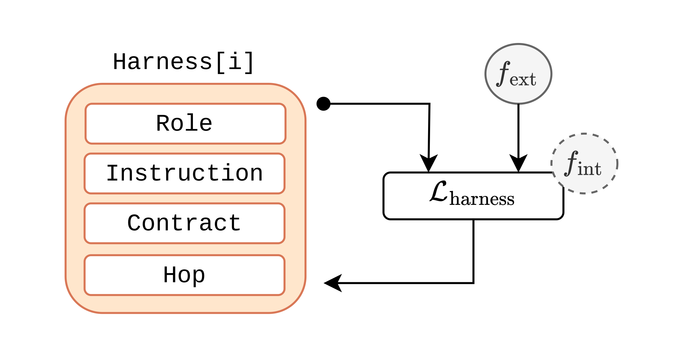
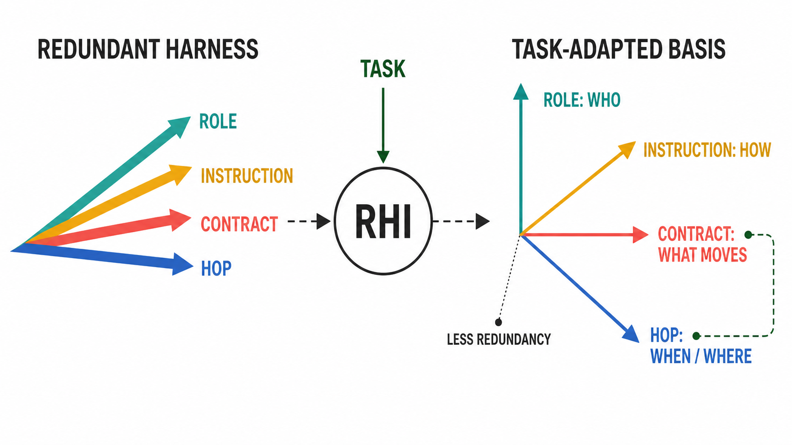

Give two agents the same model and the same task, and their performance can still differ dramatically. The difference often lies in the **harness**: the prompts, tools, memory, verification rules, and control flow that organize the model's work.

Harness design today remains closer to a craft than a science. Much of current practice consists of human-composed patterns: [reusable skills](https://code.claude.com/docs/en/skills), [specialized subagents](https://code.claude.com/docs/en/sub-agents), [single- and multi-agent orchestration](https://openai.com/business/guides-and-resources/a-practical-guide-to-building-ai-agents/), and [evaluator-optimizer or orchestrator-worker workflows](https://www.anthropic.com/engineering/building-effective-agents). These patterns are useful, but practitioners still choose, combine, and tune them empirically.

Methods such as [Meta-Harness](https://arxiv.org/abs/2603.28052), [AutoHarness](https://arxiv.org/abs/2603.03329), and [Self-Harness](https://arxiv.org/abs/2606.09498) now automate parts of this process by searching, synthesizing, or revising harness code from execution feedback. Their results show that automatic harness optimization can work. But its immediate output is still a harness artifact: it tells us *what worked on this task*, not necessarily *why it worked* or *what should transfer to the next task*.

The science begins when we ask a different question:

> What properties should a harness acquire as it improves?

A useful theory should explain what information a good harness contains, where that information belongs, and how its components should divide responsibility. Our study of **Recursive Harness Self-Improvement (RHI)** suggests a testable answer:

> **A harness improves by concentrating task information in the right components while reducing functional redundancy across all components in the system.**

Here, the redundancy term is essential. Without it, every component could repeat the task and still appear task-informative. Penalizing this overlap instead pushes components toward distinct functions.

For readers who have not yet read the paper, our earlier research blog, [Recursive Harness Self-Improvement](/Recursive-Harness-Self-Improvement/), provides a concise introduction to RHI and its main results.

## A hypothesis for the harness optimization objective

RHI represents the agent loop as a textual harness with four components:

- **Roles** define each agent's area of responsibility.
- **Instructions** specify how each agent should work.
- **Contracts** specify what information moves between agents.
- **Hops** specify when agents run and how control moves through the workflow.

Roles and instructions allocate work. Contracts and hops route information. For example, a contract can require an experimental agent to return a metric table, assumptions, and artifact paths instead of its full interaction history. A hop can invoke a reviewer only after implementation and evaluation are complete. Together, they determine what context reaches each decision and when.

RHI improves this harness without gradients or weight updates. At each iteration, the agent solves the task with the current harness. An evaluator compares the result with the previous iteration, adds its judgment to a self-comparison history, and a separate LLM proposes the next harness. Each iteration requires only one new execution and one new comparison per task.

RHI does not optimize an explicit scalar reward. Its updates emerge from the optimizer prompt, pairwise feedback, and the pretrained optimizer model. We therefore ask a deliberately narrower question than "What is the model's true latent loss?": **Are the observed updates consistent with a simple objective?**

### Two pressures behind harness improvement

The update trajectories suggest two complementary pressures. Let $\mathcal{L}_{\mathrm{harness}}$ an LLM based optimizer. An **external, controllable pressure** comes from the optimizer prompt. In RHI, that prompt emphasizes contracts and hops, biasing the search toward task-specific communication and orchestration.

An **internal, model-dependent pressure** comes from the optimizer LLM itself. The model decides how to translate feedback into edits. Empirically, those edits behave as though they favor functional specialization: the components become less redundant and assume more distinct responsibilities.

In short, the prompt chooses **where** the harness should specialize; the optimizer model decides **how**.

  
   
  <em>RHI updates reflect a controllable external pressure and a model-dependent internal pressure.</em>

The four RHI components provide one observable decomposition, but the idea is more general. A harness might instead contain system prompts, skills, tools, memory, retrieval, routing, verification, or workflow edges. This motivates the following hypothesis.

<strong>Hypothesis: a general objective for harness optimization</strong>

Let $X$ be a task drawn from a task distribution, $g_i(X)$ its harness after optimization step $i$, and $\mathcal{C}$ the set of harness components. Let $\mathcal{C}_{\mathrm{ext}}\subseteq\mathcal{C}$ contain the components explicitly targeted for task-specific adaptation, and let $Z_c^{(i)}$ represent component $c$. Effective harness optimization should:

1. **increase task information** in the targeted components; and
2. **decrease task-conditional redundancy** across the harness as a whole.

Suppressing averages over repeated components for readability, the corresponding objective is

$$
\begin{aligned}
J(g_i)
=
&\underbrace{
\sum_{c\in\mathcal{C}_{\mathrm{ext}}}
I\!\left(Z_c^{(i)};X\right)
}_{f_{\mathrm{ext}}:\;\text{task-relevant information}}
-\beta\,
\underbrace{
\mathrm{TC}\!\left(
\left\{Z_c^{(i)}:c\in\mathcal{C}\right\}
\mid X
\right)
}_{f_{\mathrm{int}}:\;\text{redundancy given the task}},
\qquad \beta>0.
\end{aligned}
$$

In one sentence: **concentrate task signal where it changes behavior, without repeating that signal everywhere.**

RHI is one instance. Here,
$\mathcal{C}=\{\mathrm{role},\mathrm{instruction},\mathrm{contract},\mathrm{hop}\}$ and
$\mathcal{C}_{\mathrm{ext}}=\{\mathrm{contract},\mathrm{hop}\}$. Our measurements support this instance. Applying the same objective to other harness decompositions is a **testable generalization**, not a result already established by our experiments.

The first term uses **mutual information**: does a targeted component reveal which task the harness is solving? A generic contract such as "return your findings" carries little task signal. A contract requesting the exact metrics, failure cases, evidence, and artifacts required by the task carries much more. In another harness, the targeted component might be a retrieval policy, verifier, or tool-selection rule.

The second term uses **task-conditional total correlation**: how much information do the components still duplicate once we account for their shared task? Conditioning matters because components should naturally be related when they serve the same task. The penalty targets only the residual overlap.

Both terms are necessary. Task information alone admits a trivial solution: copy the task description into every component. The harness would be task-specific but badly organized. Penalizing redundancy instead rewards a division of labor. A better harness is not merely more detailed; its details appear where they are useful.

### A geometric intuition: learning a task-adapted basis

Imagine possible harnesses as a high-dimensional space. In a weak harness, several components point in the same semantic direction: the role, instruction, and contract may all repeat the same request. RHI appears to reorganize them into a **task-adapted basis**, where each direction carries a different part of the coordination problem.

  
   
  <em>Geometric intuition for RHI: task information is concentrated in coordination components while the harness components separate into complementary functions.</em>

> RHI behaves less like adding text and more like rotating the harness into a task-adapted coordinate system.

In this coordinate system, roles answer *who*, instructions answer *how*, contracts answer *what information must move*, and hops answer *when and where it must move*. Contracts and hops align with the task, while the components become less redundant.

NOTE: This is an analogy, not a claim of orthogonality. **Basis learning** is more accurate than **eigenvector discovery** because RHI defines no linear operator. The evidence supports functional differentiation, not a literal eigendecomposition of harness space.

### What the measurements show

We tested the RHI instance using two embedding models, with raw and permutation-debiased estimates. The tables summarize the relative change from iteration 1 to iteration 4 across those four settings.

| Harness component | Change in estimated task information | High-level reading |
|:--|:--|:--|
| **Role** | Decreased by 30-36% | Roles became less task-specific. |
| **Instruction** | Ranged from -15% to +1% | Instructions remained broadly stable. |
| **Contract** | Increased by 25-45% | Information interfaces became more task-specific. |
| **Hop** | Increased by 15-30% | Control flow became more task-specific. |

The change is selective. Contracts and hops gain task information in every setting, while roles become less task-specific and instructions remain broadly stable. RHI does not make every field describe the task more intensely. It concentrates task information in the components that control coordination.

| Dependence measure | Change across iterations | High-level reading |
|:--|:--|:--|
| **Overall total correlation** | Decreased by 13-17% | The components shared less information overall. |
| **Task-conditional total correlation** | Decreased by 24-27% | Redundant overlap fell even after removing the shared task signal. |

Both measures decrease monotonically in every setting. Together, the tables show the pattern predicted by the objective: **contracts and hops become more informative about the task, while the harness becomes less duplicative.**

Other diagnostics tell the same story. The harnesses neither collapse to a generic template nor drift through arbitrary rewrites. Their representations remain task-dependent, and contracts stabilize earlier than other components. RHI appears to converge first on the information interface.

This evidence is correlational. RHI never evaluates $J$, and text embeddings are only external proxies for meaning. The results do **not** prove that the optimizer internally represents this objective.

### The harness design principle

> Put task-specific information in the harness components that route computation, and make every harness component contribute a distinct function instead of repeating the same context everywhere.

Here, routing computation means deciding what information reaches each component and which component runs next. 

This reframes harness optimization as an **information-organization problem**. The goal is not to make every prompt longer, add more agents, or expose every component to the full history. It is to route the right information through the right interface at the right moment, with as little duplication as possible.

A good harness does not tell every component everything. It gives each component the context it needs, a distinct responsibility, and a precise interface to the rest of the system. That is the difference between a larger prompt and a better architecture, and it is a concrete step from harness engineering by intuition toward a science of harness design.
